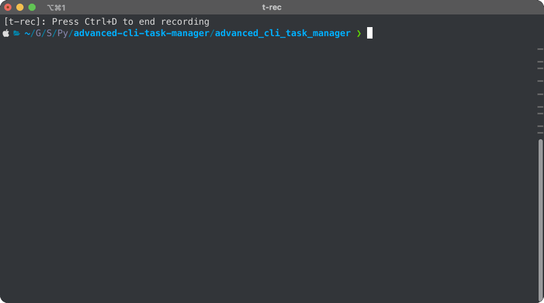

# CLI Task Manager 📝


A simple yet powerful command-line interface (CLI) tool for managing tasks. This tool allows users to add, list, and delete tasks stored in a JSON file 📁.



## Table of Contents

- [CLI Task Manager 📝](#cli-task-manager-)
  - [Table of Contents](#table-of-contents)
  - [Features](#features)
  - [Getting started](#getting-started)
  - [Unit testing](#unit-testing)

## Features

- **Add Tasks**: Easily add new tasks with optional priority levels 📝.
- **List Tasks**: View all tasks with their IDs and priorities 📊.
- **Delete Tasks**: Remove tasks by their IDs 🚮.
- **JSON Storage**: Tasks are stored in a JSON file for easy data management 💻.
- **Logging**: All actions are logged to a file for tracking and debugging 📝.
- **Environment Variable Support**: Customize the task file path using an environment variable 🌐.

## Getting started

- Install requirements :

```bash
    pip install -r requirements.txt
```

>[!NOTE]
>You can set a custom task file path using the `TASK_FILE_PATH` environment variable. By default, the tasks are stored in `tasks.json`.

- Add a new task with an optional priority level:

```bash
    python -m task_manager.cli add "Finish project" --priority 1
```

- List tasks :

```bash
python -m task_manager.cli list
```

- Delete a task by its ID:

```bash
python -m task_manager.cli delete 1
```

## Unit testing

You can run the unit tests using the following command:

```bash
python -m unittest discover tests/
```
